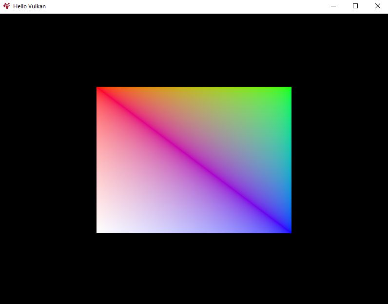

# Learning Vulkan

### Design Goals
learn_vulkan is a simple Vulkan project that is following the [Khronos Group Vulkan Tutorial](https://vulkan-tutorial.com/). It's made to be cross platform using cmake. This isn't meant to be a production engine or anything. Just a place to learn the Vulkan API so we don't use anything like VMA(Vulkan Memory Alocator) for the sake of simplicity.

### Demo
#### (This runs at about 6600FPS on my 10850k CPU and 1660S GPU)

### Project Setup
#### Things you'll need to build the project
> - git
> - cmake
> - Visual Studio Build Tools on Windows for MSbuild
> - Vulkan SDK

#### Step by step (Windows)
- git clone --recurse-submodules https://github.com/sjjahraus/learn_vulkan
- run vcpkg_windows.bat
- make sure you have VS Build tools installed and run build_windows.bat

#### Step by step (Linux)
- Comming Soon. Tell then follow windows setup and look into the .bat file. It should match pretty similarly to a .sh file.